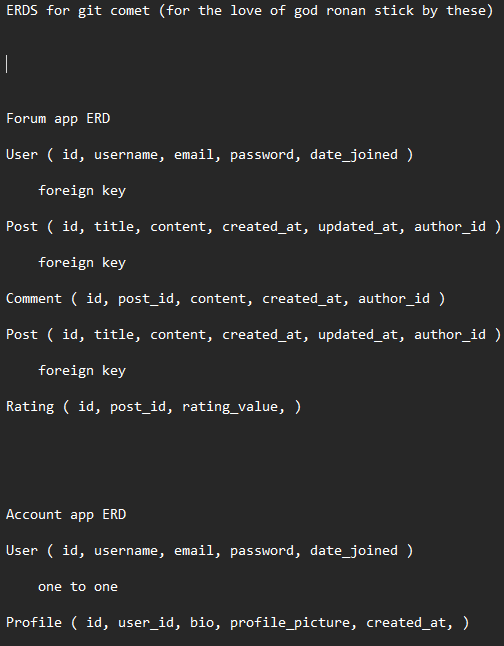

# Git Comet

Git Comet is a web forum built for coders to ask questions, make connections, or to simply chat.

## Entity Relationship Diagram

## Project Structure

The project is organized into several key directories and files:

- `account/`: Manages user accounts, including models, views, and admin configurations.
- `forum/`: Handles forum-related functionalities such as forms, views, and templates.
- `git_comet/`: The main Django application configuration, including settings and URLs.
- `static/` and `staticfiles/`: Contains static assets like CSS and JavaScript files.
- `templates/`: Stores HTML templates for rendering views.
- `manage.py`: A command-line utility for administrative tasks.
- `requirements.txt`: Lists the Python dependencies for the project.
- `Procfile`: Specifies the commands to run the application on Heroku.
- `README.md`: You're reading this right now. Hello! 👋

## Technologies Used

- **Django**
- **Heroku**
- **Gitpod**
- **Code Institute Template**
- **Code Institute Database**
- **Visual Studio Code**
- **Copilot**

## Features Implemented

1. **User Authentication**: Not done quite yet. Hopefully on the next commit.
2. **Forum**: Created a forum where users can post topics and will eventually be able to comment on posts.
3. **Admin Interface**: Customized the Django admin interface to manage user accounts and forum posts.
4. **Static Files Management**: Configured the handling of static files.
5. **Deployment**: Set up deployment configurations for Heroku, such as the `Procfile`, `runtime.txt`, and numerous Heroku config vars that I will detail on a later commit as I can't sign into Heroku, reason being, Google Authenticator decided it's going to feed me incorrect codes. Thanks Google.

## How I've Used Copilot

GitHub Copilot has been an invaluable tool throughout the development of Git Comet. However, on many occassions, Copilot has provided me with incorrect code, used techniques I'm not familiar with, and many more small issues. Despite this, I've used Copilot to great effect. Here are some of the ways Copilot has assisted me in building this project.

1. **Code Suggestions**: Copilot has provided code suggestions, helping me write code faster. It has been particularly useful for generating boilerplate code, repetitive tasks, and project wide changes (such as renaming a file).
2. **Documentation**: Copilot has assisted in writing this readme file. I wrote the content, whilst Copilot formatted it so that it doesn't look like a lunatics notepad document. Copilot has also provided me with very useful and surprisingly accurate commit messages. If only it was this accurate with its code.
3. **Debugging**: By suggesting potential fixes and improvements, Copilot has helped me debug issues more efficiently. It has provided insights into best practices and alternative approaches to solving problems.
4. **Learning**: Copilot has served as a learning tool, offering explanations and examples for various coding concepts and libraries. This has been especially helpful when working with new technologies or unfamiliar code it would often try to use.

Overall, GitHub Copilot has significantly enhanced my productivity and in some cases, the quality of my code. It has been like having an exceptionally smart (but also arrogant) person to talk to. Although it has been adamant I add code which clearly will not work, it's tried its best.

This won't be in any future version of the readme, only this commit. The issues I was having just loading a BIO PAGE is astounding. It is currently 12:33PM. I have been working on this since 7:24!!! I've had a banana and one bottle of water. What were the issues, you might be asking? What was the herculean task I had to complete to get this to work? the ritual I had to perform? The souls I had to sacrifice? Well, it was common sense. My own common sense. Such a simple fix.

I am immortalizing this as a lesson to myself.